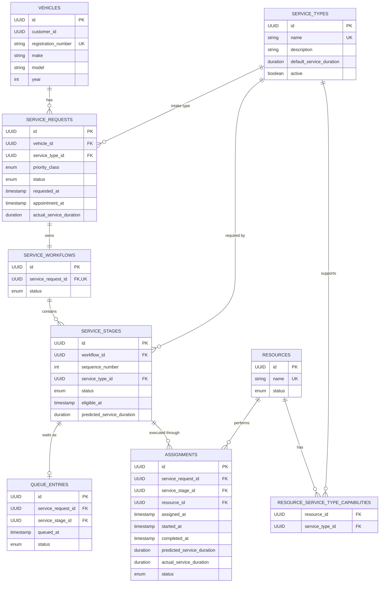

# OptiServe

> **Intelligent Service Operations & Resource Orchestration Platform for Automotive Service Centers**

OptiServe is a Spring Boot backend for managing automotive service-center operations where multiple vehicles, service requests, service stages, queues, and limited service resources compete for attention.

The project is designed around a practical problem: a simple **first-come, first-served queue is not enough** when a service center has different priorities, appointments, resource capabilities, multi-stage work, and services with different durations.

OptiServe combines:

- Multi-stage service workflows
- Priority-aware queue management
- Waiting-time aging for fairness
- Resource compatibility
- Hybrid scheduling
- Transaction-safe resource assignment
- Service execution lifecycle
- Dynamic waiting-time estimation
- A pluggable service-duration prediction abstraction, ready for a future ML service

---

## Table of Contents

- [Why OptiServe?](#why-optiserve)
- [What the System Does](#what-the-system-does)
- [End-to-End Flow](#end-to-end-flow)
- [Core Architecture](#core-architecture)
- [Domain Model](#domain-model)
- [Multi-Stage Workflow](#multi-stage-workflow)
- [Queue Management](#queue-management)
- [Hybrid Scheduler](#hybrid-scheduler)
- [Resource Assignment](#resource-assignment)
- [Service Execution](#service-execution)
- [Dynamic Waiting Time](#dynamic-waiting-time)
- [Service Duration Prediction](#service-duration-prediction)
- [Database Schema](#database-schema)
- [API Overview](#api-overview)
- [Technology Stack](#technology-stack)
- [Project Structure](#project-structure)
- [Local Setup](#local-setup)
- [Testing](#testing)
- [Concurrency and State Safety](#concurrency-and-state-safety)
- [Academic / Subject Mapping](#academic--subject-mapping)
- [Implementation Status](#implementation-status)
- [Future Extensions](#future-extensions)
- [Development Workflow](#development-workflow)

---

## Why OptiServe?

A typical service center can have situations like:

- A normal service request has already been waiting for a long time.
- An urgent vehicle arrives.
- An appointment becomes due.
- A critical vehicle arrives while every compatible resource is busy.
- Two resources can perform the same service, but one is currently occupied.
- A customer's visit contains several stages such as inspection → diagnostics → repair.
- Different stages require different capabilities.
- A short service and a long service should not always be treated identically.
- A fixed waiting-time number becomes inaccurate as the live queue changes.

A basic queue cannot handle these situations well.

OptiServe therefore separates **queue selection**, **resource assignment**, **service execution**, and **waiting-time estimation**.

The backend remains authoritative for operational decisions.

---

## What the System Does

At a high level:

```text
Vehicle
   |
   v
Service Request
   |
   v
Service Workflow
   |
   +--> Stage 1
   |      |
   |      v
   |    Queue
   |      |
   |      v
   |    Scheduler
   |      |
   |      v
   |    Compatible Resource
   |      |
   |      v
   |    Assignment
   |      |
   |      v
   |    Service Execution
   |
   +--> Stage 2
   |
   +--> Stage 3
```

Only the currently eligible stage can enter the queue. When a stage is completed, only its immediate successor becomes eligible.

---

## End-to-End Flow

```text
1. Register / select a vehicle
              |
              v
2. Create a service request
              |
              v
3. Create an ordered service workflow
              |
              v
4. First stage becomes ELIGIBLE
              |
              v
5. Stage enters the waiting queue
              |
              v
6. Hybrid scheduler selects the next candidate
              |
              v
7. A compatible AVAILABLE resource is claimed
              |
              v
8. Assignment becomes ASSIGNED
              |
              v
9. Service starts
              |
              v
10. Service completes
              |
              v
11. Next workflow stage becomes ELIGIBLE
              |
              v
12. Final stage completes the workflow
```

The queue and resource state are read from the current database state rather than relying on a permanently stored queue-position promise.

---

# Core Architecture

OptiServe is currently implemented as a **modular monolith** using Spring Boot.

The main application follows a layered/module-oriented flow:

```text
REST Controller
      |
      v
Application Service
      |
      v
Domain / Business Logic
      |
      v
Repository
      |
      v
PostgreSQL
```

The project keeps REST DTOs at the API boundary rather than exposing JPA entities directly.

The current backend also has a separate abstraction for service-duration prediction:

```text
Application / Scheduling Logic
          |
          v
ServiceDurationPredictor
          |
          +--> DefaultServiceDurationPredictor
          |        |
          |        +--> ServiceType default duration
          |
          +--> Future ML-backed implementation
```

The actual external FastAPI ML service is **not yet part of the merged backend implementation**. The current predictor is deterministic and uses the configured `ServiceType` duration.

---

# Domain Model

The current core domain contains:

| Entity | Purpose |
|---|---|
| `Vehicle` | Vehicle being serviced |
| `ServiceRequest` | Customer's service request |
| `ServiceType` | Defines a service/capability and its default duration |
| `ServiceWorkflow` | Ordered workflow belonging to one service request |
| `ServiceStage` | One executable step in a workflow |
| `QueueEntry` | Represents a waiting service stage |
| `Assignment` | Represents a stage assigned to a resource |
| `Resource` | A service resource capable of one or more service types |

### Important design choice

OptiServe uses a generic `Resource` abstraction rather than hard-coding separate `Mechanic` and `ServiceBay` tables.

A resource has capabilities represented through:

```text
Resource
   |
   +--> compatible ServiceType A
   +--> compatible ServiceType B
   +--> compatible ServiceType C
```

This allows the scheduler to reason about resource capacity and capability consistently.

---

# Multi-Stage Workflow

A service request owns exactly one workflow.

A workflow contains ordered stages:

```text
ServiceRequest
      |
      v
ServiceWorkflow
      |
      +--> Stage 1: Inspection
      |
      +--> Stage 2: Diagnostics
      |
      +--> Stage 3: Repair
      |
      +--> Stage 4: Quality Check
```

Each stage has its own `ServiceType`.

### Stage lifecycle

```text
PENDING
   |
   v
ELIGIBLE
   |
   v
QUEUED
   |
   v
ASSIGNED
   |
   v
IN_PROGRESS
   |
   v
COMPLETED
```

A stage may also be cancelled where the domain rules permit it.

The first stage starts as `ELIGIBLE`.

Later stages start as `PENDING`.

Completing a stage makes **only its immediate successor** eligible. The successor is not automatically placed into the queue.

This prevents future stages from bypassing the operational process.

---

# Queue Management

Only an `ELIGIBLE` stage can enter the queue.

When queued:

```text
ELIGIBLE stage
      |
      +--> QueueEntry = WAITING
      |
      +--> Stage = QUEUED
```

Removing a waiting stage:

```text
WAITING QueueEntry
      |
      v
QueueEntry = REMOVED
Stage = ELIGIBLE
```

Removing a queue entry does not cancel the workflow or service request.

The queue entry records when the stage entered the queue.

### Important

OptiServe does **not** persist a permanent waiting-time promise.

Waiting time is calculated dynamically.

---

# Hybrid Scheduler

The current scheduler is `HybridSchedulerStrategy`.

It is a **read-only queue selector**: it selects a candidate but does not itself mutate queue/resource/assignment state.

Only waiting queue entries whose stages are `QUEUED` are candidates.

## Priority classes

```text
CRITICAL
URGENT
APPOINTMENT
NORMAL
```

### Critical requests

`CRITICAL` requests are handled as a protected group.

They rank ahead of non-critical requests, but they **do not preempt an active service**.

If every compatible resource is busy, the critical request waits until a compatible resource becomes available.

### Non-critical scoring

The current scheduler combines:

```text
Base Priority
      +
Waiting-Time Aging
      +
Due Appointment Bonus
      +
Bounded Short-Duration Bonus
```

Current base scores are:

| Priority | Base score |
|---|---:|
| `URGENT` | 300 |
| `APPOINTMENT` | 200 |
| `NORMAL` | 100 |

Additional rules:

- Aging adds **1 point per elapsed waiting minute**.
- A due appointment receives a **25-point bonus**.
- A predicted service duration below the 60-minute reference can receive a bounded short-duration bonus.
- The maximum duration bonus is **30 points**.
- Missing predicted duration receives no duration bonus.

### Tie breakers

When scores are equal, selection is deterministic:

1. Earlier queue-entry time
2. Earlier service-request creation time
3. Queue-entry UUID

This makes concurrent/system behavior easier to reason about and test.

---

# Resource Assignment

The scheduler and assignment process are intentionally separated.

```text
Queue
  |
  v
Scheduler selects candidate
  |
  v
Find compatible AVAILABLE resources
  |
  v
Lock/recheck state
  |
  v
Create Assignment
  |
  +--> Stage = ASSIGNED
  +--> Resource = BUSY
  +--> QueueEntry = REMOVED
```

All relevant state changes occur atomically.

A resource can only be assigned when:

- It is `AVAILABLE`
- It is compatible with the stage's `ServiceType`
- It is not already serving another active assignment

If no compatible resource is available, the selected stage remains queued.

Resource selection is deterministic by resource name and UUID after compatibility/availability filtering.

---

# Service Execution

Assignments follow:

```text
ASSIGNED
   |
   v
IN_PROGRESS
   |
   v
COMPLETED
```

### Starting a service

Starting an assignment:

- records `startedAt`
- changes the assignment to `IN_PROGRESS`
- changes the stage to `IN_PROGRESS`

### Completing a service

Completion:

- records `completedAt`
- records supplied actual duration when provided
- otherwise derives actual duration from elapsed execution time
- changes the assignment to `COMPLETED`
- changes the stage to `COMPLETED`
- releases the resource back to `AVAILABLE` unless the resource is `OFFLINE`

For a multi-stage workflow:

```text
Stage 1 completed
      |
      v
Stage 2 becomes ELIGIBLE
```

The next stage is not automatically queued.

When the final stage completes:

```text
ServiceStage = COMPLETED
ServiceWorkflow = COMPLETED
ServiceRequest = COMPLETED
```

---

# Dynamic Waiting Time

OptiServe exposes:

```http
GET /api/queue/stages/{stageId}/wait-time
```

The response contains:

- `stageId`
- `estimatedWaitMinutes`
- `queueStatus`
- `priority`
- `calculatedAt`

## The important architectural rule

> **Waiting time is an estimate, not a fixed stored value.**

The backend calculates it from current state.

Conceptually:

```text
Current time
     +
Active assignment remaining time
     +
Compatible queued work ahead
     +
Resource availability
     +
Scheduler ordering
     =
Estimated wait
```

For multiple compatible resources, the calculation considers the independent resource lanes and the earliest compatible availability.

An active assignment's remaining time is derived from its current execution state and predicted/default duration. Overdue remaining duration is clamped to zero.

Work that cannot use any compatible resource lane is not incorrectly added to the target's wait estimate.

Because the calculation is performed from current state, the estimate can change when:

- a service starts
- a service completes
- a new request enters
- a critical request enters
- a queue entry is removed
- a resource changes availability
- service duration information changes

No background polling job is required for the current wait-time implementation.

---

# Service Duration Prediction

The project deliberately separates **service duration prediction** from **queue waiting-time estimation**.

```text
ML predicts:
    "How long will this service take?"

Backend calculates:
    "How long until this stage can start?"
```

The current merged backend contains:

```java
ServiceDurationPredictor
```

and:

```java
DefaultServiceDurationPredictor
```

The current implementation returns the `ServiceType` default duration.

This is a deterministic placeholder/implementation boundary, not an ML model.

### Planned integration

The intended future architecture is:

```text
Spring Boot
     |
     v
ServiceDurationPredictor
     |
     v
ML-backed implementation
     |
     v
FastAPI prediction service
     |
     v
Trained regression model
```

The prediction will remain non-authoritative. The backend scheduler remains responsible for operational decisions.

---

# Database Schema

The database is PostgreSQL and is managed through Flyway migrations.

Current migrations:

```text
V1  create operations schema
V2  case-insensitive service type names
V3  case-insensitive resource names
V4  add service workflows and stages
V5  create vehicles
V6  add vehicle to service requests
```

## Tables

### `service_types`

Stores service definitions.

Important fields:

- `id`
- `name`
- `description`
- `default_service_duration`
- `active`
- timestamps

Default service duration must be positive.

---

### `resources`

Represents service resources.

Important fields:

- `id`
- `name`
- `status`
- timestamps

Resource status:

```text
AVAILABLE
BUSY
OFFLINE
```

---

### `resource_service_type_capabilities`

Many-to-many relationship between resources and service types.

```text
Resource <----> ServiceType
```

This determines which resources are compatible with which service stages.

---

### `service_requests`

Represents incoming service requests.

Important fields include:

- `id`
- `service_type_id`
- `vehicle_id`
- `priority_class`
- `status`
- `requested_at`
- `appointment_at`
- `actual_service_duration`

Priority classes:

```text
CRITICAL
URGENT
APPOINTMENT
NORMAL
```

Request statuses include:

```text
CREATED
WAITING
ASSIGNED
IN_SERVICE
COMPLETED
CANCELLED
NO_SHOW
```

---

### `vehicles`

Represents the vehicle being serviced.

Important fields:

- `id`
- `customer_id`
- `registration_number`
- `make`
- `model`
- `year`
- timestamps

The `customer_id` is currently an external identifier. A dedicated customer domain has not yet been introduced.

Registration numbers are normalized and unique.

---

### `service_workflows`

One workflow belongs to one service request.

Important fields:

- `id`
- `service_request_id`
- `status`
- timestamps

Workflow status:

```text
ACTIVE
COMPLETED
CANCELLED
```

---

### `service_stages`

Represents ordered executable work inside a workflow.

Important fields:

- `id`
- `workflow_id`
- `sequence_number`
- `service_type_id`
- `status`
- `eligible_at`
- `predicted_service_duration`
- timestamps

Each workflow has unique stage sequence numbers.

---

### `queue_entries`

Represents stages currently waiting in the queue.

Important fields:

- `id`
- `service_request_id`
- `service_stage_id`
- `queued_at`
- `status`

Queue status:

```text
WAITING
REMOVED
```

Partial unique indexes prevent duplicate active queue entries.

---

### `assignments`

Represents actual execution assignment.

Important fields include:

- `id`
- `service_request_id`
- `service_stage_id`
- `resource_id`
- `assigned_at`
- `started_at`
- `completed_at`
- `predicted_service_duration`
- `actual_service_duration`
- `status`

Assignment status:

```text
ASSIGNED
IN_PROGRESS
COMPLETED
CANCELLED
```

Partial unique indexes prevent:

- multiple active assignments for the same request/stage
- multiple active assignments on the same resource

---

## ER Diagram



`resource_service_type_capabilities` is the join table behind the `RESOURCES ↔ SERVICE_TYPES` many-to-many relationship.

---

# API Overview

## Service Types

| Method | Endpoint | Purpose |
|---|---|---|
| `POST` | `/api/service-types` | Create service type |
| `GET` | `/api/service-types` | List service types |
| `GET` | `/api/service-types/{id}` | Get service type |
| `PATCH` | `/api/service-types/{id}` | Update service type |
| `DELETE` | `/api/service-types/{id}` | Delete/deactivate service type |

## Resources

| Method | Endpoint | Purpose |
|---|---|---|
| `POST` | `/api/resources` | Create resource |
| `GET` | `/api/resources` | List resources |
| `GET` | `/api/resources/{id}` | Get resource |
| `PATCH` | `/api/resources/{id}` | Update resource |
| `PATCH` | `/api/resources/{id}/status` | Change resource status |
| `PUT` | `/api/resources/{resourceId}/service-types/{serviceTypeId}` | Add compatibility |
| `DELETE` | `/api/resources/{resourceId}/service-types/{serviceTypeId}` | Remove compatibility |
| `GET` | `/api/resources/{resourceId}/service-types` | List compatible service types |
| `DELETE` | `/api/resources/{id}` | Delete/deactivate resource |

## Service Requests

| Method | Endpoint | Purpose |
|---|---|---|
| `POST` | `/api/service-requests` | Create request and workflow |
| `GET` | `/api/service-requests` | List requests |
| `GET` | `/api/service-requests/{id}` | Get request |

Service-request creation creates the workflow and ordered stages atomically. It does not automatically enqueue or assign a stage.

## Queue

| Method | Endpoint | Purpose |
|---|---|---|
| `POST` | `/api/queue/stages/{stageId}` | Queue an eligible stage |
| `GET` | `/api/queue` | List queued stages |
| `DELETE` | `/api/queue/stages/{stageId}` | Remove a waiting stage |
| `GET` | `/api/queue/stages/{stageId}/wait-time` | Calculate current wait estimate |

## Assignments

| Method | Endpoint | Purpose |
|---|---|---|
| `POST` | `/api/assignments/next` | Select and assign next queued stage |
| `POST` | `/api/assignments/{assignmentId}/start` | Start assignment |
| `POST` | `/api/assignments/{assignmentId}/complete` | Complete assignment |

---

# Technology Stack

| Technology | Role |
|---|---|
| Java 21 | Backend language |
| Spring Boot 4.1.1 | Application framework |
| Spring Web MVC | REST APIs |
| Spring Data JPA | Persistence |
| PostgreSQL | Relational database |
| Flyway | Database migrations |
| Spring Security | Stateless HTTP Basic security baseline |
| Jakarta Bean Validation | Request validation |
| Lombok | Java boilerplate reduction |
| Maven Wrapper | Build and dependency management |
| JUnit / Spring test support | Automated testing |

The current backend does **not** include an external ML dependency or FastAPI client yet.

---

# Project Structure

```text
OptiServe/
├── .gitignore
├── AGENTS.md
├── PLAN.md
├── docs/
│   └── DOMAIN_RULES.md
└── optiserve-backend/
    ├── pom.xml
    ├── mvnw
    ├── mvnw.cmd
    ├── .mvn/
    │   └── wrapper/
    └── src/
        ├── main/
        │   ├── java/
        │   │   └── com/minor_project/optiserve_backend/
        │   │       ├── common/
        │   │       ├── configuration/
        │   │       └── operations/
        │   │           ├── assignment/
        │   │           ├── domain/
        │   │           ├── duration/
        │   │           ├── persistence/
        │   │           ├── queue/
        │   │           ├── resource/
        │   │           ├── scheduler/
        │   │           ├── servicerequest/
        │   │           ├── servicetype/
        │   │           └── waittime/
        │   └── resources/
        │       ├── application.properties
        │       └── db/
        │           └── migration/
        │               ├── V1__create_operations_schema.sql
        │               ├── V2__enforce_case_insensitive_service_type_names.sql
        │               ├── V3__enforce_case_insensitive_resource_names.sql
        │               ├── V4__add_service_workflows_and_stages.sql
        │               ├── V5__create_vehicles.sql
        │               └── V6__add_vehicle_to_service_requests.sql
        └── test/
            └── java/
```

The `operations` modules keep the main business capabilities separated while remaining in one deployable Spring Boot application.

---

# Local Setup

## Prerequisites

Install:

- JDK 21
- PostgreSQL
- Git

The repository includes the Maven Wrapper, so a separate Maven installation is not required.

## Create the database

Create a PostgreSQL database named:

```text
optiserve
```

The application uses Flyway to create/update the schema.

## Configure environment variables

The application expects:

```text
OPTISERVE_DB_URL
OPTISERVE_DB_USERNAME
OPTISERVE_DB_PASSWORD
```

Example:

```text
OPTISERVE_DB_URL=jdbc:postgresql://localhost:5432/optiserve
OPTISERVE_DB_USERNAME=postgres
OPTISERVE_DB_PASSWORD=<your-local-password>
```

Do not commit real credentials.

The application is configured to:

- validate the Hibernate schema against the database
- run Flyway migrations
- disable Open Session in View

## Run tests

From:

```text
optiserve-backend/
```

Windows:

```bat
mvnw.cmd test
```

## Build

```bat
mvnw.cmd clean package
```

## Run locally

```bat
mvnw.cmd spring-boot:run
```

The application uses the standard Spring Boot HTTP port unless overridden by configuration.

---

# Security Baseline

The current backend uses:

- stateless HTTP
- HTTP Basic authentication
- CSRF disabled for the stateless API
- all requests authenticated

The current security configuration is a development baseline. It is not presented as the project's final production identity/access-management design.

Do not commit credentials or secrets.

---

# Testing

The project uses automated unit and integration testing across:

- domain behavior
- application services
- REST controllers
- persistence
- Flyway migrations
- scheduler behavior
- queue behavior
- assignment behavior
- service execution lifecycle
- dynamic wait-time calculation
- Spring dependency injection
- concurrency-sensitive assignment flows

The Phase 6B checkpoint brought the merged backend test suite to **100 passing tests** with no failures or errors.

The exact test count will naturally change as new features are added.

---

# Concurrency and State Safety

A major part of OptiServe is preventing two operations from claiming the same work/resource simultaneously.

For example:

```text
Worker A ──┐
           ├──> Same waiting stage
Worker B ──┘
```

or:

```text
Worker A ──┐
           ├──> Same resource
Worker B ──┘
```

The backend uses:

- explicit transaction boundaries
- pessimistic database locking where required
- deterministic resource selection
- partial unique database indexes
- state re-checks before mutation

The database also protects active uniqueness.

Examples:

```text
One resource
    ↓
At most one active assignment

One service request
    ↓
At most one active assignment

One waiting stage
    ↓
At most one active queue entry
```

This makes the database part of the correctness boundary rather than relying only on application-level checks.

---

# Academic / Subject Mapping

OptiServe is also designed to demonstrate concepts from multiple subjects.

| Subject | OptiServe application |
|---|---|
| **DSA** | Queue management, priority-based selection, comparator-based scheduling |
| **ADA** | FCFS concepts, priority scheduling, aging, bounded shortest-job preference |
| **OOP** | Interfaces, encapsulation, strategy abstraction, polymorphism |
| **OS** | Resource allocation, concurrency, locking, race-condition prevention |
| **DBMS** | PostgreSQL, relationships, foreign keys, constraints, indexes, transactions |
| **Computer Networks** | REST APIs and future Spring Boot ↔ ML-service communication |
| **Machine Learning** | Service-duration prediction integration boundary |
| **Software Engineering** | Modular architecture, Git branches, PR workflow, testing, migrations |

---

# Implementation Status

## Implemented

- [x] Spring Boot backend foundation
- [x] PostgreSQL integration
- [x] Flyway migrations
- [x] Common API error handling
- [x] Validation
- [x] Stateless security baseline
- [x] Service type management
- [x] Resource management
- [x] Resource/service-type compatibility
- [x] Vehicle foundation
- [x] Service request creation
- [x] Multi-stage service workflows
- [x] Queue management
- [x] Hybrid scheduler
- [x] Critical request handling
- [x] Waiting-time aging
- [x] Appointment bonus
- [x] Bounded duration-based scheduling adjustment
- [x] Transaction-safe resource assignment
- [x] Concurrent assignment protection
- [x] Service execution lifecycle
- [x] Workflow continuation
- [x] Dynamic waiting-time calculation
- [x] Dynamic wait-time REST endpoint
- [x] `ServiceDurationPredictor` abstraction
- [x] Deterministic default duration predictor

## In Progress

- [ ] Separate ML service for service-duration prediction
- [ ] Spring Boot integration with the ML prediction service

## Planned

Potential later work includes:

- [ ] Resilient ML client with timeout/fallback behavior
- [ ] Contract tests between Spring Boot and FastAPI
- [ ] ML-backed service-duration prediction
- [ ] No-show prediction
- [ ] Customer notification/approval workflow
- [ ] Operational analytics
- [ ] Dashboard APIs
- [ ] Expanded customer management
- [ ] More detailed resource types/specializations
- [ ] Production deployment and operational hardening

Planned features are intentionally not represented as current functionality.

---

# Future ML Architecture

The intended architecture is:

```text
                  ┌──────────────────────┐
                  │   Spring Boot API    │
                  └──────────┬───────────┘
                             |
                             v
                  ┌──────────────────────┐
                  │ ServiceDuration       │
                  │ Predictor             │
                  └──────────┬───────────┘
                             |
                             v
                  ┌──────────────────────┐
                  │ ML-backed predictor   │
                  └──────────┬───────────┘
                             |
                             v
                  ┌──────────────────────┐
                  │ FastAPI ML Service    │
                  └──────────┬───────────┘
                             |
                             v
                  ┌──────────────────────┐
                  │ Duration Model        │
                  │ (regression)         │
                  └──────────────────────┘
```

The ML service will predict **service duration**.

It will not become the authority for queue order, resource state, or waiting-time promises.

---

# Development Workflow

The project is developed incrementally using focused feature branches.

Typical flow:

```text
main
  |
  +--> feature/<focused-change>
              |
              +--> tests
              |
              +--> validation
              |
              +--> pull request
              |
              +--> main
```

Development expectations:

- Keep changes focused.
- Do not expose JPA entities directly through REST.
- Add tests with new behavior.
- Use Flyway for schema changes.
- Keep secrets out of version control.
- Avoid unrelated changes in feature branches.
- Review database and state-transition behavior carefully.
- Do not treat predicted duration as authoritative waiting time.

---

# Design Principles

OptiServe is built around a few important principles:

### 1. Scheduler and assignment are separate

The scheduler chooses **what should go next**.

The assignment operation determines **whether a compatible resource can actually take it**.

### 2. Waiting time is dynamic

The system does not promise a fixed wait number.

It calculates an estimate from the current operational state.

### 3. Critical does not mean preemptive

A critical request receives priority for the next compatible resource but does not interrupt an active service.

### 4. Workflow stages are the operational unit

A customer visit may contain multiple stages, and each stage can require a different capability.

### 5. Database constraints are part of correctness

Transactions, locks, foreign keys, indexes, and unique constraints work together with application logic to protect state.

### 6. ML is advisory

Machine learning can estimate service duration, but the backend remains authoritative for operational decisions.

---

## License

No project license has currently been declared in the repository.

---

## Project

**OptiServe — Intelligent Service Operations & Resource Orchestration Platform**

Built as a semester minor project with a focus on applying backend engineering, databases, algorithms, concurrency, and machine learning concepts to a real-world service-center problem.
