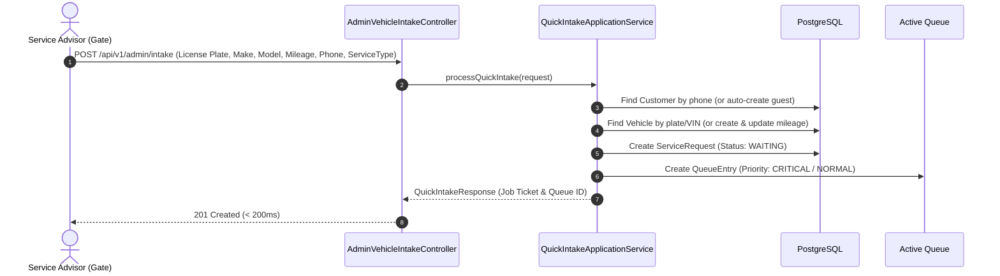

# OptiServe — Intelligent Automotive Service & Bay Allocation Platform

OptiServe is a high-performance **modular monolith** backend engineered in **Java 21** and **Spring Boot**, designed for automotive service centers, dealerships, and fleet depots. It features **dynamic priority queue scheduling**, **dual-resource (Bay + Mechanic) capability matching**, and **machine-learning-assisted wait-time prediction**.

---

## ?? Architecture & Design Principles

OptiServe follows clean modular monolith architecture with strict dependency boundaries:

$$\text{Controller} \longrightarrow \text{Application Service} \longrightarrow \text{Domain / Business Logic} \longrightarrow \text{Repository}$$

- **Authoritative Scheduler vs. Non-Authoritative ML:** A separate FastAPI service predicts expected service duration based on vehicle characteristics (make, model, mileage, job type). The Spring Boot core scheduler treats this prediction as an input to compute authoritative queue positions, waiting times, and bay assignments.
- **Concurrency & Double-Booking Protection:** Enforced at the PostgreSQL level using partial unique indexes, ensuring no mechanic or bay can be assigned to multiple vehicles simultaneously.
- **Stateless Security with RBAC:** JWT authentication (HMAC-SHA256) with role-based access control (`ROLE_CUSTOMER`, `ROLE_ADMIN`, `ROLE_SERVICE_ADVISOR`).

---

## ?? Domain Model & The Workshop Reality

Unlike generic counter queue systems, a car service workshop requires composite scheduling:

1. **Service Bays (`ServiceBay`):** Physical bays classified by equipment (`GENERAL`, `DIAGNOSTIC`, `ALIGNMENT`, `BODY_REPAIR`, `EV`) and status (`AVAILABLE`, `OCCUPIED`, `MAINTENANCE`, `OFFLINE`).
2. **Technicians (`Mechanic`):** Workshop personnel classified by status (`AVAILABLE`, `BUSY`, `ON_LEAVE`, `OFFLINE`).
3. **Dual Capability Matching:**
   - `mechanic_service_type_capabilities`: Ensures the assigned technician is certified for the job.
   - `bay_service_type_capabilities`: Ensures the assigned bay has the physical tools (e.g. lift, alignment rack).
4. **Vehicles (`Vehicle`):** Stores VIN (17-char unique identifier), license plate, make, model, manufacturing year, and odometer mileage.
5. **Customers (`Customer`):** Supports both registered web portal users and walk-in/emergency guest profiles with phone-based identification.
6. **Service Requests & Active Queue:**
   - Priority Classes: `CRITICAL` (Ambulances, emergency response), `URGENT`, `APPOINTMENT`, `NORMAL`.
   - Starvation Prevention: Waiting-time aging gradually boosts the effective priority of low-priority tickets.
   - Emergency Preemption: `CRITICAL` vehicles take the next available compatible bay without canceling or aborting in-progress repairs.

---

## ?? Security & Role-Based Access Control (JWT)

OptiServe implements stateless JWT authentication powered by JJWT (`0.12.6`) and Spring Security:

- **Roles:**
  - `ROLE_CUSTOMER`: Regular portal users booking service appointments.
  - `ROLE_SERVICE_ADVISOR`: Workshop gate attendants performing fast vehicle intake.
  - `ROLE_ADMIN`: Workshop supervisors managing bay allocations, mechanics, and system configuration.
- **JWT Filter Chain (`JwtAuthenticationFilter`):**
  - Intercepts incoming `Authorization: Bearer <token>` headers.
  - Validates token claims and expiration.
  - Injects authenticated user credentials and authorities into Spring's `SecurityContextHolder`.
- **Method Security:** Enabled via `@EnableMethodSecurity`, allowing granular `@PreAuthorize("hasAnyRole('ADMIN', 'SERVICE_ADVISOR')")` annotations across endpoints.

---

## ? Admin "Fast-Intake" Engine (Zero-Friction Check-In)

Emergency vehicles (ambulances, police cars) or walk-in customers arriving at the gate cannot be forced to register on a website.

The **Fast-Intake Engine** (`POST /api/v1/admin/intake`) allows service advisors to intake vehicles in a single **atomic transaction**:



---

## ??? Database Schema & Flyway Migrations

Database versioning is managed via Flyway:

- **`V1__create_operations_schema.sql`:**
  - Establishes core `service_types`, `service_requests`, `queue_entries`, and baseline `assignments`.
- **`V2__add_vehicle_and_service_tables.sql`:**
  - Replaces generic resources with `service_bays` and `mechanics`.
  - Creates `customers` (with role support) and `vehicles` (linked via foreign keys).
  - Establishes dual capability tables: `bay_service_type_capabilities` and `mechanic_service_type_capabilities`.
  - Creates partial unique indexes:
    - `uq_assignments_active_mechanic` WHERE `status IN ('ASSIGNED', 'IN_PROGRESS')`
    - `uq_assignments_active_bay` WHERE `status IN ('ASSIGNED', 'IN_PROGRESS')`

---

## ?? REST API Reference

### 1. Authentication & Registration
| Method | Endpoint | Access | Description |
| :--- | :--- | :--- | :--- |
| `POST` | `/register` | Public | Register a new customer account |
| `POST` | `/login` | Public | Authenticate with username/password and obtain JWT token |

### 2. Operations & Fast Intake (Admins / Service Advisors)
| Method | Endpoint | Access | Description |
| :--- | :--- | :--- | :--- |
| `POST` | `/api/v1/admin/intake` | `ADMIN`, `SERVICE_ADVISOR` | One-shot fast check-in for vehicles, auto-linking customer and enqueuing request |

#### Sample Fast-Intake Payload (`POST /api/v1/admin/intake`):
```json
{
  "registrationNumber": "MH12AB1234",
  "vin": "1HGCR2F83HA123456",
  "make": "Toyota",
  "model": "Innova Crysta",
  "manufacturingYear": 2021,
  "fuelType": "DIESEL",
  "currentMileage": 48500,
  "customerName": "Rahul Sharma",
  "customerPhone": "+919876543210",
  "customerEmail": "rahul@example.com",
  "serviceTypeId": "3fa85f64-5717-4562-b3fc-2c963f66afa6",
  "priorityClass": "NORMAL"
}
```

---

## ??? Tech Stack

- **Backend:** Java 21, Spring Boot 4.1.x, Spring Security 6.x, Spring Data JPA
- **Database:** PostgreSQL with Flyway Migrations
- **Security:** JJWT 0.12.6 (JWT Bearer Token Authentication)
- **Tooling:** Maven, Lombok, Jakarta Validation
- **Testing:** JUnit 5, AssertJ, Spring Boot Test

---

## ?? Running Locally

### 1. Prerequisites
- Java 21 SDK
- PostgreSQL 15+ running locally (default database: `optiserve_db`)

### 2. Compile & Run Tests
From `optiserve-backend/`:
```bash
# Compile and run unit/domain tests
./mvnw.cmd test

# Package JAR
./mvnw.cmd clean package

# Start application locally
./mvnw.cmd spring-boot:run
```
